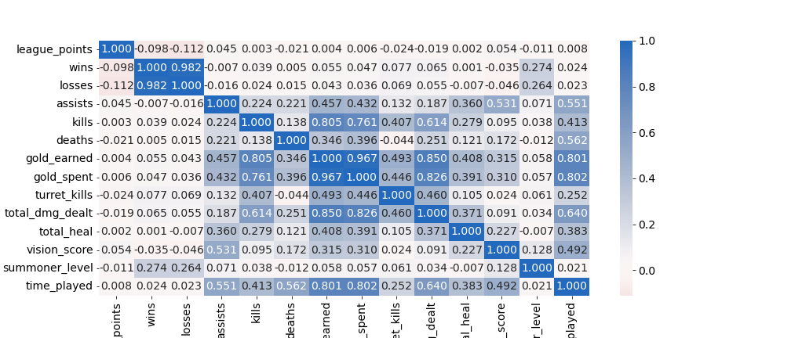
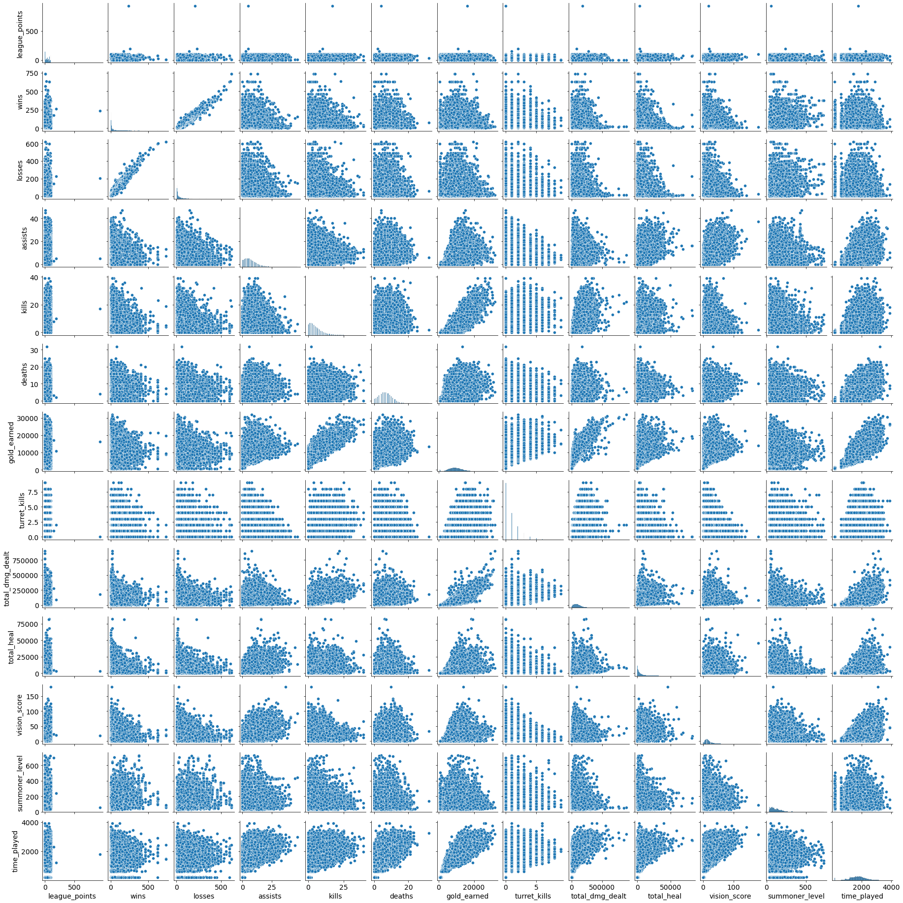
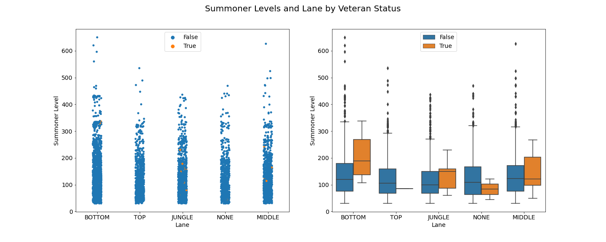
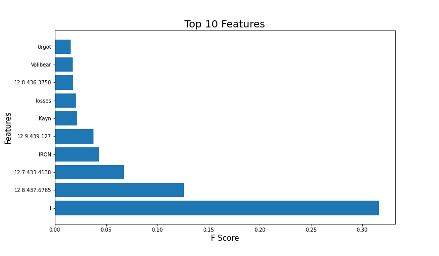
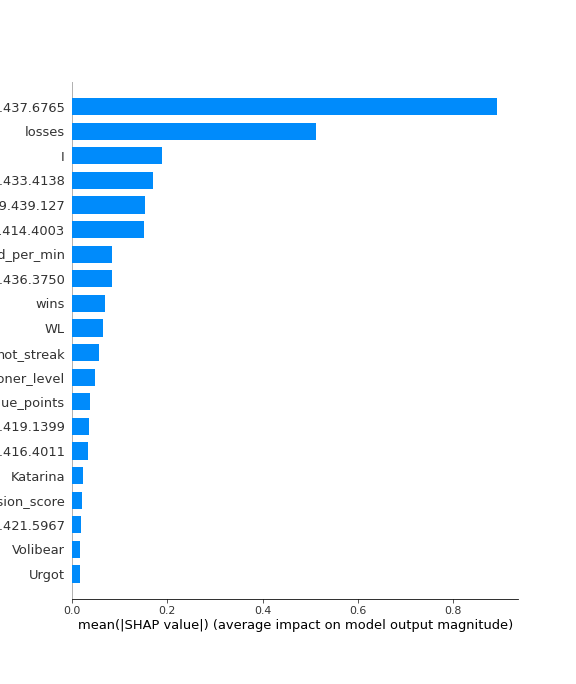
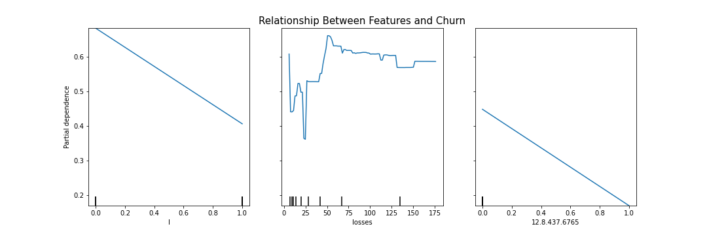

## Table of Contents
1. [Project Organization](#organize)
    1. [Setup](#setup)
    2. [Deployment](#deploy)
2. [Objective](#objective)
3. [Extraction](#extract)
    1. [Riot API](#riot)
    2. [Requesting Data](#req)
4. [Exploratory Data Analysis](#eda)
    1. [Dataset](#dataset)
    2. [Data Cleaning](#cleaning)
    3. [Exploration](#explore)
5. [Modelling](#model)
    1. [Feature Engineering](#engineering)
    2. [Basic Modelling](#basic)
    3. [Hyperparameter Tuning](htuning)
6. [Insights](#insight)
    1. [Feature Importance](#importance)
    2. [SHAP](#shap)
    3. [Partial Depedency Plots](#pdp)
==============================

## Project Organization <a name="organize"></a>
------------
```
├── LICENSE
├── docker-compose.yml <- YAML file which contains docker compose build instructions.
├── README.md          <- The top-level README for this project.
│
├── backend            <- FastAPI with uvicorn/swagger api implementation.
│   ├── Dockerfile     <- Dockerfile required for the docker compose.
│   ├── main.py        <- Main python file which runs backend server.
│   ├── model_pkl      <- Pickle file which contains the model in binary.
│   └── requirements.txt  <- Requirements file for Dockerfile.
│
├── data
│   ├── processed      <- The final, canonical data sets for modeling.
│   └── raw            <- The original, immutable data dump.
│
├── frontend
│   ├── Dockerfile     <- Dockerfile required for the docker compose.
│   ├── ui.py          <- Streamlit framework used for the UI.
│   └── requirements.txt  <- requirements file for Dockerfile.
│
├── models             <- Trained and serialized models, model predictions, or model summaries
│
├── notebooks          <- Jupyter notebooks. 
│
├── reports            <- Generated analysis as HTML, PDF, LaTeX, etc.
│   └── figures        <- Generated graphics and figures to be used in reporting
│
├── requirements.txt   <- The requirements file for reproducing the analysis environment, e.g.
│                         generated with `pip freeze > requirements.txt`
│
└── src                <- Source code for use in this project.
    ├── __init__.py    <- Makes src a Python module
    │
    ├── data           <- Scripts to download or generate data
    │   ├── __init__.py    <- Makes src a Python module
    │   └── make_dataset.py
    │
    │
    └── models         <- Scripts to train models and then use trained models to make predictions
        ├── __init__.py    <- Makes src a Python module
        └── train_model.py
```

### Setup <a name="setup"></a>

In order to access the analysis in the notebooks please follow the below steps:

1. cd into the directory folder `Lol_Churn_Prediction`

2. create and activate your conda or virtualenv for this project

3. run: `pip install -r requirements.txt` in your shell

### Deployment <a name="deploy"></a>

For deployment I chose to host the project in AWS ECS Fargate with a Load Balancer.

Built Docker images using `docker compose build` and pushed those images into my docker hub repository.

Then I created an ECS context for Docker using my already configured AWS CLI with profile and policy settings: [policy requirements](https://docs.docker.com/cloud/ecs-integration/#requirements)

Ran `docker compose up` onto the ECS with LB.

To view the frontend: [frontend](http://lol-c-loadb-qj8n2k09lgcs-240da7a2a911aabf.elb.us-east-1.amazonaws.com:8501/)

To view the backend docs: [backend](http://lol-c-loadb-qj8n2k09lgcs-240da7a2a911aabf.elb.us-east-1.amazonaws.com:8000/docs)

Server is currently up and predictions are working!

## Objective <a name="objective"></a>

The goal of this project is to predict ranked League of Legends player churn. League of Legends is a massive online battle arena game that pits 5 vs. 5 matches on the classic Summoner's Rift map. The goal of the game is to conquer the opposing teams Nexus. Players achieve this by using champions in the game which have a wide array of abilities. Utilizing these champions a team earns their win by killing minions, acquiring gold, killing turrets, killing other players, and capturing important map objectives.


Churn is when a customer stops using a product, in this case I'm interested in whether a league of legends summoner (players are called summoners in League of Legends) stops playing the ranked game mode. 

I extract the data I need from the Riot API, analyze the data to find interesting relationships, model the data using machine learning techniques, and then finally I deploy the model to the cloud.

## Extraction <a name="extract"></a>

You can access the jupyter notebook here: [Extraction](notebooks/v1.0_LoL_Churn_Prediction_Ben_Pacheco_Extraction.ipynb) 

### Riot API <a name="riot"></a>

Several endpoints were used to gather the data.

`LEAGUE-V4`: https://developer.riotgames.com/apis#league-v4/GET_getLeagueEntries
`SUMMONER-V4`: https://developer.riotgames.com/apis#summoner-v4/GET_getBySummonerName
`MATCH-V5`: https://developer.riotgames.com/apis#match-v5/GET_getMatchIdsByPUUID
`MATCH-V5`: https://developer.riotgames.com/apis#match-v5/GET_getMatch

### Requesting Data <a name="req"></a>

At first I used a naive approach to request the data which involved using the requests library and the get method to check if the status code was 200 (which means successful request). This worked up until I started hitting a roadblock in my request limitations.
Riot API limits their developers with a product API key that only allows you to request 100 times per 2 minutes. This was not enough speed for the amount of data I was trying to source. Therefore I had to leave the requests running overnight with a custom timeout function (took about 10-16 hours per pull) in order to fetch the rest of the data from the end points.

## Exploratory Data Analysis <a name="eda"></a>

You can access the jupyter notebook here: [EDA](notebooks/v1.0_LoL_Churn_Prediction_Ben_Pacheco_EDA_Wrangling.ipynb) 

### Dataset <a name="dataset"></a>

The initial dataset consists of ranked league and summoner data joined together. A reminder that this is not the entire data of all the ranked players but only a sample and some bias to take note: the data was pulled on 05/17/2022 and we can only access data as far as 2 years back. 

Therefore in order to feature engineer `churn` we can say that: players had their first match on the earliest dates we can extract from
so in this case that is ~12/01/2020. Churn is any summoner that stopped playing ranked league of legends for more than 30 days.

Columns:

***Categorical***
- `summoner_name`: name of the ranked league of legends player
- `rank`: rank of the summoner (lower numeral is better)
- `veteran`: boolean value which tells us if a summoner has been playing in the same tier for 28 days
- `fresh_blood`: boolean value which tells us if a summoner is new to the game
- `hot_streak`: boolean value which tells us if the summoner has been winning back-to-back games
- `tier`: tier that the summoner places in (based off hidden MMR/ELO system) with IRON being the worse and Challenger being the best
- `match_id`: the given match id of the ranked match a summoner participated in
- `game_end_timestamp`: timestamp when a match ends
- `game_start_timestamp`: timestamp when a match starts
- `game_version`: the current league of legends patch
- `lane`: the lane a summoner plays in (in this MOBA its top-jungle-mid-bottom-none)
- `champion_name`: the name of the champion a summoner uses for the match
- `last_match`: the last match a summoner has played given time constraints

***Numerical***
- `league_points`: the amount of league points a summoner has acquired within their respective league
- `wins`: the amount of wins a summoner has acquired 
- `losses`: the amount of losses a summoner has acquired 
- `assists`: the amount of assist points a summoner has acquired within the match, earned by helping a teammate get a kill
- `kills`: the amount of kill points a summoner has acquired within the match, earned by killing an opposing champion
- `deaths`: the amount of death points a summoner has acquired within the match, earned by losing all health on champion
- `gold_earned`: the amount of gold a summoner has acquired within the match
- `turret_kills`: the amount of turrets a summoner has destroyed within the match
- `total_dmg_dealt`: the amount of damage a summoner inflicts onto the opposing team/objective
- `total_heal`: the amount of heals a summoner performs during the match, supports usually fufill this
- `vision_score`: the amount of score given to the summoner based on placing wards within the match
- `summoner_level`: the current level of the summoner
- `time_played`: the amount of time in seconds a summoner spends in the match

**Table 1** Dataset (before Feature Engineering)

|    | summoner_name   |   league_points | rank   |   wins |   losses | veteran   | fresh_blood   | hot_streak   | tier   | match_id       | game_end_timestamp   | game_start_timestamp   | game_version   |   assists |   kills |   deaths | lane   | champion_name   |   gold_earned |   turret_kills |   total_dmg_dealt |   total_heal |   vision_score |   summoner_level |   time_played | last_match          |
|---:|:----------------|----------------:|:-------|-------:|---------:|:----------|:--------------|:-------------|:-------|:---------------|:---------------------|:-----------------------|:---------------|----------:|--------:|---------:|:-------|:----------------|--------------:|---------------:|------------------:|-------------:|---------------:|-----------------:|--------------:|:--------------------|
|  0 | Soundwave2017   |               0 | I      |      3 |       11 | False     | False         | False        | IRON   | NA1_4306888010 | 2022-05-14 03:48:50  | 2022-05-14 03:07:53    | 12.9.439.127   |        14 |       6 |        8 | BOTTOM | Jhin            |         14003 |              0 |            178703 |         7305 |             26 |              212 |          2456 | 2022-05-14 03:48:50 |
|  1 | Soundwave2017   |               0 | I      |      3 |       11 | False     | False         | False        | IRON   | NA1_4304706779 | 2022-05-12 03:27:24  | 2022-05-12 02:54:10    | 12.9.439.127   |         5 |       7 |        6 | MIDDLE | Gangplank       |         11613 |              1 |            115684 |         5374 |             17 |              211 |          1993 | 2022-05-14 03:48:50 |
|  2 | Soundwave2017   |               0 | I      |      3 |       11 | False     | False         | False        | IRON   | NA1_4298584602 | 2022-05-06 03:05:37  | 2022-05-06 02:33:34    | 12.8.437.6765  |         5 |       1 |       10 | MIDDLE | Swain           |          8416 |              0 |             75323 |         2979 |             15 |              210 |          1922 | 2022-05-14 03:48:50 |
|  3 | Soundwave2017   |               0 | I      |      3 |       11 | False     | False         | False        | IRON   | NA1_4298580129 | 2022-05-06 02:27:52  | 2022-05-06 02:08:24    | 12.8.437.6765  |         5 |       1 |        3 | NONE   | Swain           |          4849 |              0 |             50486 |         2779 |              7 |              210 |          1167 | 2022-05-14 03:48:50 |
|  4 | Soundwave2017   |               0 | I      |      3 |       11 | False     | False         | False        | IRON   | NA1_4297843161 | 2022-05-05 04:06:32  | 2022-05-05 03:35:56    | 12.8.437.6765  |         8 |       6 |       12 | MIDDLE | Swain           |         10215 |              0 |             95855 |         5115 |             13 |              210 |          1835 | 2022-05-14 03:48:50 |


### Data Cleaning <a name="cleaning"></a>

Please check out the notebook to see the various wrangling techniques i've implemented.

**Table 2** Initial column data types and null value descriptions (before Feature Engineering)

```
Column                Non-Null Count  Dtype         
------                --------------  -----         
summoner_name         33710 non-null  object        
league_points         33710 non-null  int64         
rank                  33710 non-null  object        
wins                  33710 non-null  int64         
losses                33710 non-null  int64         
veteran               33710 non-null  bool          
fresh_blood           33710 non-null  bool          
hot_streak            33710 non-null  bool          
tier                  33710 non-null  object        
match_id              33710 non-null  object        
game_end_timestamp    33710 non-null  datetime64[ns]
game_start_timestamp  33710 non-null  datetime64[ns]
game_version          33710 non-null  object        
assists               33710 non-null  int64         
kills                 33710 non-null  int64         
deaths                33710 non-null  int64         
lane                  33710 non-null  object        
champion_name         33710 non-null  object        
gold_earned           33710 non-null  int64         
turret_kills          33710 non-null  int64         
total_dmg_dealt       33710 non-null  int64         
total_heal            33710 non-null  int64         
vision_score          33710 non-null  int64         
summoner_level        33710 non-null  int64         
time_played           33710 non-null  int64         
last_match            33710 non-null  datetime64[ns]
```

### Exploration <a name="explore"></a>



**Figure 1** shows the correlation matrix plot for the features.

I ended up dropping gold_spent here since it was:

1. redundant to have since gold_earned is already a good economic metric
2. had high correlations with several variables

After checking the corr matrix I did a pairplot to check for any significant outliers, but in game data we need to be sure that they are truly outliers
and not just overperformers.



**Figure 2** shows the pairplot for the features.

I decided not to drop any outliers here since these players are most likely just really good at the game and have higher than average stats.

In one of my first assumptions I thought veteran, summoner_levels were going to be huge in the predicting power of the ML models. I assumed this because I thought the longer a person plays the game the more likely they would not quit the service/product. Turns out later on after some modelling that I was wrong but it's insightful to take a deeper look into the interactions between these features anyway before modelling.



**Figure 3** shows the multivariate plot of summoner levels and lane by veteran status

Turns out that the higher level your summoner level the more likely it is you play a `BOTTOM` role. Higher leveled Veterans preferred `MIDDLE` which makes sense since you have control of the map playing MID. Pivoting off this I made sure to check if veteran summoners were more likely to perform, and it turns out that they do in fact in all categories!

## Modelling <a name="model"></a>

You can access the jupyter notebook here: [Modelling](notebooks/v1.0_LoL_Churn_Prediction_Ben_Pacheco_FeatureEng_Modeling.ipynb)

### Feature Engineering <a name="engineering"></a>

The current dataset does not have a target variable so I needed to create one. `churn` was created by taking the difference between the last match a summoner has played and the date the data was pulled "2022-05-17". If a summoner hasn't played for more than 30 days from that difference result then they are flagged as "True" for the `churn` column.

Value Counts for `churn`:

False    19708
True     14002
Name: churn, dtype: int64

It's some what of a balanced dataset, I decided not to add/remove data and kept it as is. My thought process was that I would see any balancing issues later on during modelling, and I'm using tree-based estimators regardless which perform good on imbalanced data.

I also added a couple of features that I thought would have significance in model performance such as:

`KDA`: I took the `kills` + `assists` columns divided by `deaths` to obtain this ratio
`WL`: this is the win/loss ratio, a simple division of wins over losses
`gold_earned_per_min`: I felt the need of adding a time-based metric for the ecnonomy of the game, this is simply (`gold_earned` / `time_played`) / 60 (since time played is in seconds)

Since ML models don't understand categorical data and only numeric I passed my categorical columns into a columntransformer along with the OneHotEncoder class method.
Fitting and transforming our X allowed us to do basic modelling.

### Basic Modelling <a name="basic"></a>

For the basic modelling approach I split my data into train and testing data with a 80/20 ratio. Then I called on the model class, fit the model, and finally evaluated the accuracy/f1 scores. Keep in mind accuracy can be misleading with imbalanced data, our data was not so balanced therefore I had to make sure to measure the f1-score as well. After doing all of that I wanted to compare with cross validation to see if we get any bump in performance.

Model with metrics:

***Logistic Regression***
accuracy:  0.5928507861168792
f1-score:  0.029006013441811106
**crossvalidation**
accuracy:  0.5545832097300505
f1-score:  0.07363964449649193

***Random Forest***
accuracy:  0.9476416493622071
f1-score:  0.9356426618049225
**crossvalidation**
accuracy:  0.5576090180955207
f1-score:  0.39953069322410173

***XGBoost Classifier***
accuracy:  0.9557994660338178
f1-score:  0.9460926193921853
**crossvalidation**
accuracy:  0.5441412043903886
f1-score:  0.46049543758268624

With default parameters the models seem to perform in this order: XGBoost > Random Forest > Logistic Regression
Overall cross validation did not help any of the models perform any better.

### Hyperparameter Tuning <a name="htuning"></a>

My first naive approach was to implement a GridSearchCV with given parameter grid. This was very computationally expensive and I had to leave it running for several hours to get some answers. 

Surprisingly the best model to perform using this approach was the Random Forest! It achieved 57% accuracy and 58% f1-score with the following parameters:

`max_depth`: 30
`n_estimators`: 5

GridSearch did not do me enough justice therefore I decided to explore further with a module I just recently learned about, Optuna.

Optuna allows us to perform Bayesian Optimization methods that are efficient because they choose the next hyperparameters in an informed manner. Bayesian hyperparameter optimization builds a probability model of the objective function and uses it to select the most promising hyperparameters to evaluate in the true objective function.

Optuna makes use of the Tree-structed Parzen Estimator algorithm. To set up Optuna I just needed to define an objective function, give it my scalers/transformers, and all the classifier parameters to choose from as "suggestions". Optuna will run the objective function for a given amount of desired trials and spit out the best accuracy or any other metric of your choosing. Optuna can either minimize or maximize for the study object that you create, so it can find the best least value or best highest value for that given metric.

Results using Optuna:

***XGBoost Classifier***
accuracy: 0.9574310293681401.
f1-score: 0.9470013947001394
precision: 0.9285470085470086
recall:  0.9662041977943793

Hyperparameters:
`scaler`: Robust
`max_depth`: 20
`learning_rate`: 0.00719580052831331
`n_estimators`: 198

So I've managed to squeeze out an extra 0.1-0.2% of performance for my XGBoost model for accuracy and f1, that's pretty good!

## Insights <a name="insight"></a>

### Feature Importance <a name="importance"></a>



**Figure 4** shows the fscore for internal feature importance method

Interestingly enough, Rank I is the most important feature using the built-in feature_importances method. Along with rank, patch version seems to be significant too. This could be due to many factors which I assume caused these to be important in the model:

1. Rank I is the lowest rank in any tier, therefore retention rate of summoners playing ranked league of legends is much lower in the lowest ranks of any tier.

2. Patch version 12.8 (any game version with 12.8.XXX.XXXX) introduced many buffs throughout common oppressive champions such as Kassadin, Mordekaiser, Poppy.

3. Just like rank I, IRON is the lowest of the lows when it comes to tiers. Iron was actually introduced much later in the game around season 2019-2021 when Riot decided Bronze was not enough of a base skill floor for players the lowest tier was shifted from Bronze to Iron.

### SHAP <a name="shap"></a>



**Figure 5** shows the mean SHAP values for features

Compared to the previous feature importances game version 12.8 seems to be the most important feature. Losses actually jumped in importance when computing SHAP as well. A summoner that loses more often has more probability to churn. Losing in any game could make the experience unenjoyable and therefore you quit playing that game.

To prove these assumptions I need to implement partial dependency plots. Partial dependence plots are a great way (though not the only way) to extract insights from complex models. These can be incredibly powerful for communicating those insights to colleagues or non-technical users.

### Partial Depedency Plots <a name="pdp"></a>



**Figure 6** shows the relationship between features and churn

The Partial Dependency Plots show negative linear relationships amongst the several inputs vs. the target variable. This means that churn depends linearly on rank I, and patch 12.8.437.6765. For losses though it's much harder to interpret, but overall even though the relationship is not linear it leans towards negative correlation as the amount of losses increase. The probability that a summoner churns decreases when a summoner is categorized in either of these features.

Could it be that lower ranked players are actually less likely to quit the game? My original assumptions were that lower leveled/lower skilled players were more likely to give up the game after some frustration. Also another interesting one is that patch 12.8 which introduced many buffs/nerfs to the game seemed to have a huge impact on the predictions.


# lol-churn-prediction
